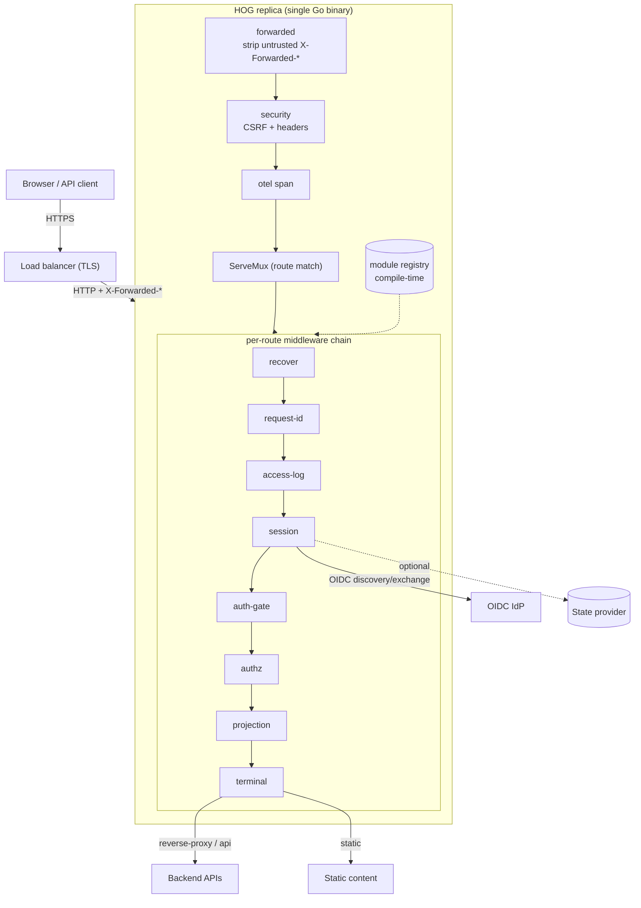

# Architecture

HOG runs as a single Go process. At boot it loads a set of YAML resources,
parses them into typed configuration, and assembles one `http.Handler`: a
standard-library `ServeMux` where every route is bound to its own composed
middleware chain in front of a terminal handler. There is no separate control
plane, no sidecar, and no dynamic module loading — the binary that serves your
frontend is the same binary that runs the gateway logic.

Five pieces make up that assembly:

- **The config loader** (`config` package) reads a file or a directory of YAML
  documents, expands `${ENV}` references, and decodes each document into a
  generic resource: `kind`, `metadata`, `spec`.
- **The resource model** (`app.Parse`, `gateway`, `route`) turns resources into
  typed configuration — one `Gateway`, a set of `Route` and `RouteGroup`
  objects, `Policy` rules, an optional `IdP`, and plugin instances.
- **The middleware chain** (`chain` package) wraps every route's terminal
  handler with a fixed built-in skeleton plus two guarded slots for developer
  plugins.
- **Terminal handlers** (`terminal` package, plus custom modules) end the
  chain: serve static files, reverse-proxy to a backend, aggregate several
  backends into one JSON response, or answer an auth/system endpoint.
- **The module registry** (`registry` package) is the extension seam under all
  of it — every terminal handler, IdP connector, state provider, and plugin is
  a named factory built from configuration.

At a high level, a request moves through the same shape regardless of which
route it hits:

```text
request in
   │
   ▼
ServeMux match → Route
   │
   ▼
middleware chain (fixed skeleton + guarded plugin slots)
   │
   ▼
terminal handler
   │
   ▼
backend call / file read / auth or system response
   │
   ▼
response out
```

The diagram below fills in the same shape with the actual pieces: the
gateway-wide edge layers every request crosses first, the fixed per-route
chain behind the `ServeMux`, and where backend calls, static content, and the
OIDC IdP fit in.



The chapters in this section cover each piece in detail:

- [Request lifecycle](request-lifecycle.md) — the exact stage order a request
  passes through, and what each stage does.
- [Configuration model](configuration-model.md) — the resource kinds, `${ENV}`
  expansion, and how a route's effective policy is resolved.
- [Extensibility](extensibility.md) — how the module registry works and how
  plugins get compiled into a binary.
- [Deployment topology](deployment.md) — how HOG runs in production: the
  process model, session state, and container images.
