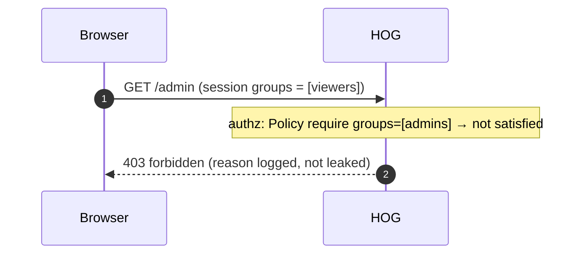
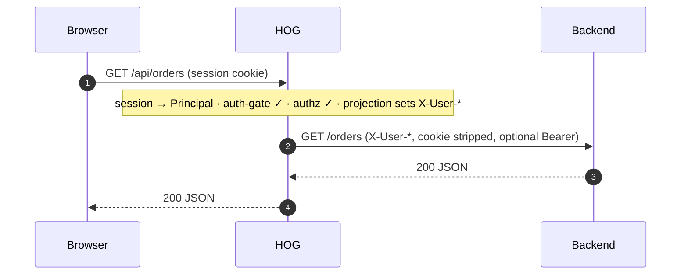

# Request lifecycle

Every request that reaches HOG passes through the same shape: two gateway-wide
edge layers wrapping the whole handler, an outer tracing wrapper, a route
match, a fixed chain of built-in per-route stages, two guarded slots for
developer plugins, and finally a terminal handler. The per-route chain is
assembled once per route at boot (`app.Build`, `chain.Skeleton`) and applied
to every request that route serves; the two edge layers are assembled once
for the whole gateway and wrap everything — routes and the raw `/auth/*`
endpoints alike.

## The gateway-wide edge layers

`app.Build` wraps the entire handler — the `ServeMux` plus its OpenTelemetry
wrapper — in two outermost layers, in this order (outermost first):

```text
forwarded → security → otel → ServeMux (routes + /auth/*)
```

**forwarded** (`chain.Forwarded`) strips inbound `X-Forwarded-For`,
`X-Forwarded-Proto`, `X-Forwarded-Host`, `X-Forwarded-Port`, `X-Real-Ip`, and
`Forwarded` headers whenever the immediate peer isn't in `Gateway.spec.trustedProxies`.
It runs before everything else, including the OpenTelemetry wrapper, because
`otelhttp` reads raw `X-Forwarded-For` for the span's `client.address` —
untrusted values must be gone before anything, including tracing, ever sees
them. See [deployment: behind a trusted proxy](deployment.md#behind-a-trusted-proxy).

**security** (`security.Build`) applies CSRF protection
(`net/http.CrossOriginProtection`) and static security response headers
(`X-Frame-Options`, `X-Content-Type-Options`, `Referrer-Policy`,
`Strict-Transport-Security`, and an opt-in `Content-Security-Policy`) to
every response. It wraps the OpenTelemetry layer (runs just inside
`forwarded`, just outside `otel`) and is gateway-wide — it covers
`/auth/login`, `/auth/callback`, and every other raw endpoint, not just
routed traffic. See [operations: security](../operations/security.md).

Both layers apply to **everything** — they are not part of the per-route
skeleton below, precisely so a route can't opt out of them and the raw auth
endpoints (which have no `Route` resource of their own) are still covered.

## The fixed per-route skeleton

Once a request reaches the `ServeMux` and matches a `Route`, it runs through
that route's own composed chain. `chain/builtin.go` defines the built-in
per-route stages in a fixed order — outermost first:

```text
recover → request-id → access-log → session → auth-gate → authz → projection
```

**recover** catches a panic anywhere further in — including the terminal —
logs it with the request's trace and span IDs, and returns `500` instead of
crashing the process.

**request-id** reads an inbound `X-Request-Id` header or generates one, and
echoes it back on the response, so a request can be correlated across logs.

**access-log** wraps the response writer to capture the final status code and
emits one structured log line after the handler returns — method, path,
status, duration, and, when a `Telemetry` resource is configured, trace
correlation and additional fields.

**session** resolves the caller's identity into a request-scoped `Principal`.
For `app` routes it reads the encrypted session cookie. For `service` routes
it also accepts an `Authorization: Bearer` token, verified against the
configured IdP, when no valid cookie is present — the cookie always wins if
both are sent. A missing or invalid credential does not reject the request
here; it simply leaves it unauthenticated.

**auth-gate** enforces the route's effective `auth: required|public` setting.
This is the stage that turns a missing identity into a rejection: a browser
(`app`) route gets a `302` redirect to the login path with the original URL
preserved as `return_to`; a `service` route gets a `401` with a
`WWW-Authenticate` header.

**authz** evaluates the route's effective authorization set — its own
`access.authorize` plus every matching `RouteGroup`'s — against the resolved
identity and the request's attributes. Any policy that denies returns `403`.
This stage runs independently of whether a session or IdP is configured at
all, since a policy can match on request attributes alone.

A deny short-circuits right there — no further stage runs, and the response
body carries no policy detail (the reason is logged and recorded on the
request span instead):



**projection** strips any inbound `X-User-*` headers as an anti-spoofing
measure and, only when a principal is present in context, injects identity
headers for the backend to trust: a subject header, a groups header, and
either derived or explicitly mapped claim headers.

Put together, a request that clears every gate looks like this — session
resolves the `Principal`, auth-gate and authz let it through, and projection
hands the backend a trustworthy identity instead of the raw cookie:



## The guarded plugin slots and the terminal

Two more positions exist after the fixed per-route skeleton, both reserved
for developer code and both selector-matched against the route's labels, in
YAML document order:

```text
forwarded                                        ┐
  security                                       │  gateway-wide edge layers
    otel                                         ┘  (app.Build; wrap routes AND /auth/*)
      ServeMux
        ├─ /auth/* (login, callback, logout, session-info) → handled directly,
        │   no per-route skeleton
        └─ matched Route:
             recover                                  ┐
               request-id                              │
                 access-log                              │  fixed per-route skeleton
                   session                                 │  (chain.Skeleton)
                     auth-gate                               │
                       authz                                   │
                         projection                               ┘
                           request-plugins   (developer, YAML order)
                             response-plugins (developer, YAML order)
                               terminal handler
```

**request-plugins** run after every gate has passed and before the terminal —
they can inspect or short-circuit the fully-authenticated, fully-authorized
request.

**response-plugins** sit closest to the terminal, so on the way back out they
are the first to see the response — they shape the final status and content
(for example, reshaping an aggregated API response) before it unwinds back
through projection, authz, session, access-log, and out.

The terminal handler ends the per-route chain: `static`, `reverse-proxy`,
`api` (aggregation), or the built-in `health` system endpoint. The
`/auth/login`, `/auth/callback`, `/auth/logout`, and session-info endpoints
aren't `Route` resources at all — they're mounted directly on the `ServeMux`
and reached only through the gateway-wide edge layers above, never through
the per-route skeleton (no `recover`/`request-id`/`access-log`/`session`/
`auth-gate`/`authz`/`projection` around them).

A full OIDC browser login exercises exactly those raw endpoints — a
protected `app` route's `auth-gate` redirects to `/auth/login`, which is
itself outside the per-route skeleton, before the round trip lands back on a
now-authenticated request to the original route:

```mermaid
sequenceDiagram
  autonumber
  participant B as Browser
  participant H as HOG
  participant I as OIDC IdP
  B->>H: GET /app (no session)
  H-->>B: 302 → /auth/login
  B->>H: GET /auth/login
  H-->>B: 302 → IdP authorize (PKCE + state)
  B->>I: authenticate
  I-->>B: 302 → /auth/callback?code&state
  B->>H: GET /auth/callback
  H->>I: exchange code, verify id_token
  H-->>B: Set-Cookie (encrypted session); 302 → /app
  B->>H: GET /app (session cookie)
  H-->>B: 200
```

## Reserved slots activate only when configured

`session`, `auth-gate`, and `projection` come from `chain.Gates`, supplied by
`app.Build`. When neither a `session` block nor an `IdP` resource is
configured, `app.Build` leaves those fields nil and `chain.Skeleton` fills
them with a pass-through — an all-public gateway with no IdP costs nothing
extra at these stages. `authz` is decided independently, per route: it
activates only when that route, directly or through a matching `RouteGroup`,
references at least one `Policy` by name.

## Order consequences

Because **auth-gate runs before authz**, an unauthenticated request to a
protected route is redirected or rejected before any policy is evaluated —
authz never has to account for a missing identity.

Because **projection runs after authz**, identity headers are injected only
into a request that has already been allowed through. A request denied by
authz never reaches projection, and never reaches the backend.

See [authentication](../operations/authentication.md) and
[authorization](../operations/authorization.md) for how to configure the
session, IdP, and policy resources that fill these stages.
